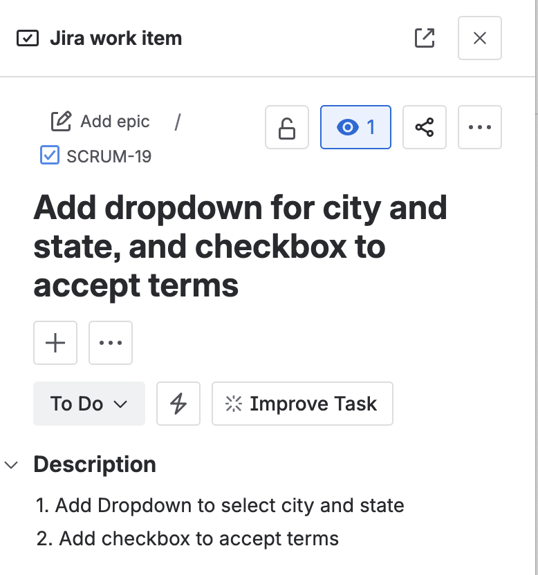
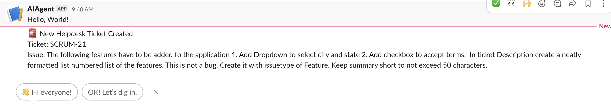
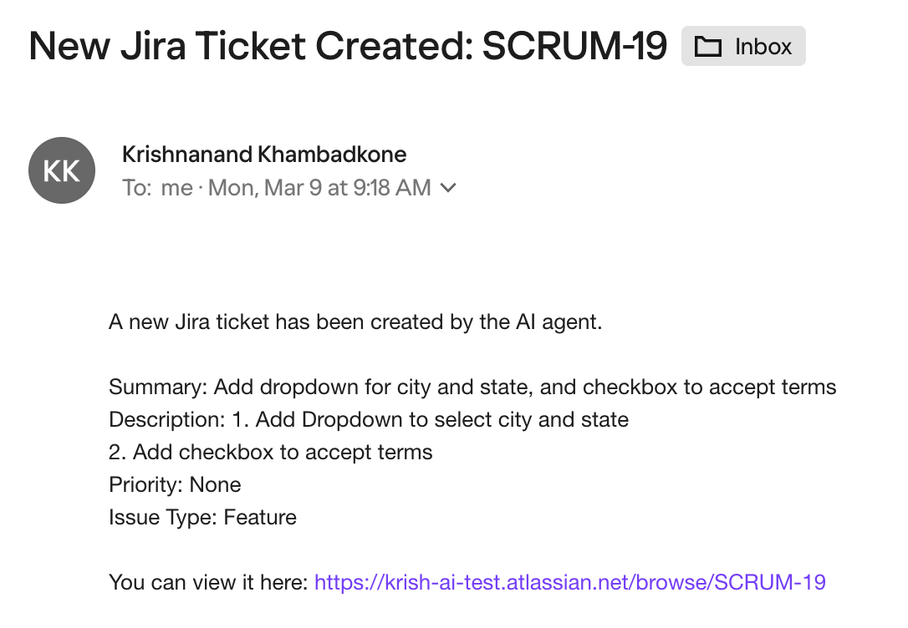

# AI Helpdesk Agent

An **AI-powered helpdesk agent** that automatically analyzes user-reported issues using an LLM and performs automated incident management actions such as:

* Creating **Jira tickets**
* Sending **email notifications**
* Posting **Slack alerts**

The agent uses **Llama3 via Ollama** to understand problem descriptions and determine the appropriate **priority** and **issue type**.

---

# Features

* 🤖 **AI-powered issue classification**
* 🎫 **Automatic Jira ticket creation**
* 📧 **Email notification to support teams**
* 💬 **Slack alerts for real-time monitoring**
* ⚡ **Fully automated helpdesk workflow**

---

# Architecture

```
User Problem
      ↓
LLM (Llama3 via Ollama)
      ↓
AI Decision Engine
      ↓
Automation Tools
 ├── Jira API
 ├── SMTP Email
 └── Slack Webhook
```

The AI agent analyzes the issue and automatically decides:

* Issue **priority** (Low, Medium, High)
* Issue **type** (Bug, Task, Story)
* Whether to send **email notifications**
* Whether to send **Slack alerts**

---

# Example Workflow

**Input:**

```
Production website is down and users cannot log in.
```

**AI Decision:**

```
Priority: High
Issue Type: Bug
Slack Alert: Yes
Email Notification: Yes
```

**Actions Performed:**

1. Jira ticket created
2. Email notification sent
3. Slack alert posted

---

# Requirements

* Python 3.9+
* Ollama
* Jira Cloud account
* Slack workspace
* SMTP email account

Python dependencies:

```
pip install requests
```

---

# Running the LLM

Install Ollama and run Llama3 locally.

Install Ollama:

https://ollama.com

Pull the model:

```
ollama pull llama3
```

Start the Ollama service.

---

# Configuration

Edit the configuration section in the script:

```
OLLAMA_URL = "http://localhost:11434/api/generate"

JIRA_URL = "https://your-domain.atlassian.net"
JIRA_EMAIL = "your_email@example.com"
JIRA_API_TOKEN = "your_jira_api_token"
JIRA_PROJECT_KEY = "TEST"

SMTP_SERVER = "smtp.gmail.com"
SMTP_PORT = 587
EMAIL_USER = "your_email@gmail.com"
EMAIL_PASS = "your_app_password"

SLACK_WEBHOOK = "https://hooks.slack.com/services/XXXX/XXXX/XXXX"
```

---

# Jira Setup

Create an API token:

https://id.atlassian.com/manage-profile/security/api-tokens

Use your **email + API token** for authentication.

---

# Slack Setup

1. Create a Slack app
2. Enable **Incoming Webhooks**
3. Add a webhook to your desired channel
4. Copy the webhook URL into the script

Slack API documentation:

https://api.slack.com/messaging/webhooks

---

# Running the Agent

Run the script:

```
python generatejiraticketAIAgent.py  
```

Enter a problem description:

```
Describe the problem: The following features have to be added to the application 1. Add Dropdown to select city and state 2. Add checkbox to accept terms.  In ticket Description create a neatly formatted list numbered list of the features. This is not a bug. Create it with issuetype of Feature. Keep summary short to not exceed 50 characters.

---

# Example Output

Analyzing issue using AI...

AI Decision: {'priority': 'Low', 'issue_type': 'Feature', 'needs_slack': True, 'needs_email': False}
{'id': '10094', 'key': 'SCRUM-21', 'self': 'https://krish-ai-test.atlassian.net/rest/api/3/issue/10094'}
Jira ticket created: SCRUM-21
Slack notification sent

---
## Example Jira Ticket




## Example Slack channel notification



## Example Email 
                      


---

# Project Structure

```
ai-helpdesk-agent/
│
├── ai_helpdesk_agent.py
├── README.md
└── requirements.txt
```

---

# Future Enhancements

Possible improvements:

* Retrieval-Augmented Generation (RAG) using a **vector database**
* Incident knowledge base with **ChromaDB**
* Root cause suggestions based on historical incidents
* Automated remediation actions
* Integration with monitoring tools

---

# Technologies Used

* Python
* Ollama
* Llama3
* Jira REST API
* Slack Webhooks
* SMTP Email

---

# License

MIT License

---

# Author

Krishnanand Khambadkone

AI / Data / Cloud Enthusiast

